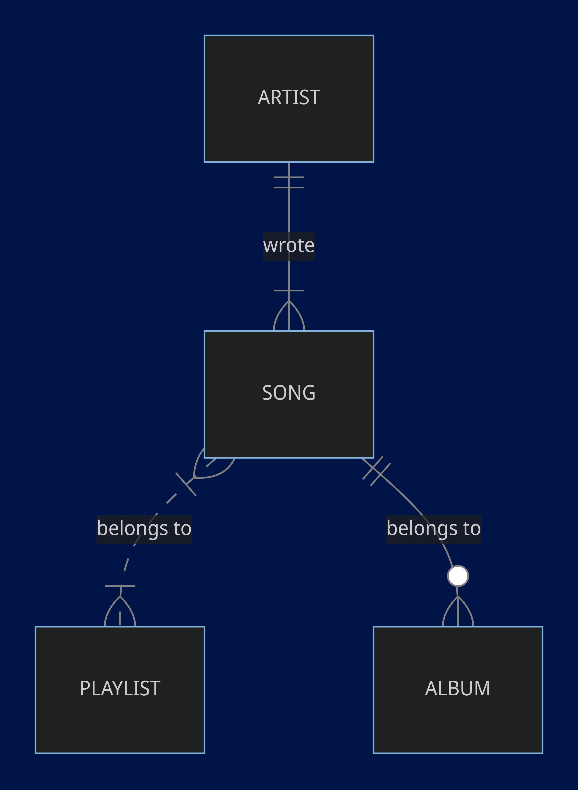

# Design Document

By Nicoleta Cilibiu

Video overview: <https://youtu.be/wsCe5j3T6xY?si=MQdOC5QjvyJXIl2O>

## Scope

The database for CS50 SQL includes all entities necessary to facilitate the process of tracking your favorite songs on Spotify. As such, included in the database's scope is:

* Songs, all of your favorite songs and some info about them
* Artists that wrote the songs, including their debut and main genre
* Playlists with your favorite songs, including created time and number of songs
* Albums created by your favorite artists, including artist, main genre, release date and number of songs

## Functional Requirements

This database will support:

* CRUD operations for users
* Tracking all playlists created and new favorite songs

Note that in this iteration, we suppose that the relations between artists, songs and albums are already created.

## Representation
Entities are captured in SQLite tables with the following schema.

### Entities

The database includes the following entities:

#### Songs

The `songs` table includes:

* `id`, which specifies the unique ID for the song as an `INTEGER`. This column thus has the `PRIMARY KEY` constraint applied.
* `title`, which specifies the name of the song as `TEXT` and has the `NOT NULL` constraint applied.
* `genre`, which is a `TEXT` specifying the music genre of the song and has the `NOT NULL` constraint applied.
* `release_date`, which is a `NUMERIC` column that specifies a date and has the `NOT NULL` constraint applied.

#### Artists

The `artists` table includes:

* `id`, which specifies the unique ID for the artist as an `INTEGER`. This column thus has the `PRIMARY KEY` constraint applied.
* `name`, which specifies the name of the artist as `TEXT` and has the `NOT NULL` constraint applied.
* `debut`, which is a `NUMERIC` column that specifies a date and has the `NOT NULL` constraint applied.
* `main_genre`, which is a `TEXT` specifying the music genre of the songs that the artists writes and has the `NOT NULL` constraint applied.

#### Albums

The `albums` table includes:

* `id`, which specifies the unique ID for the album as an `INTEGER`. This column thus has the `PRIMARY KEY` constraint applied.
* `title`, which specifies the title of the album as `TEXT` and has the `NOT NULL` constraint applied.
* `artist_id`, which references the unique ID for the artist as an `INTEGER`. This column thus has the `FOREIGN KEY` constraint applied.
* `release_date`, which is a `NUMERIC` column that specifies a date and has the `NOT NULL` constraint applied.
* `main_genre`, which is a `TEXT` specifying the music genre of the songs in the album and has the `NOT NULL` constraint applied.
* `number_of_songs`, which is a `INTEGER` and has the `NOT NULL` constraint applied.

#### Playlists

The `playlist` table includes:

* `id`, which specifies the unique ID for the playlist as an `INTEGER`. This column thus has the `PRIMARY KEY` constraint applied.
* `name`, which specifies the name of the playlist as `TEXT` and has the `NOT NULL` and `UNIQUE` constraints applied.
* `created`, which is a `NUMERIC` column that specifies a date and has the `NOT NULL` constraint applied. For this column the default is `CURRENT_TIMESTAMP`.
* `number_of_songs`, which is a `INTEGER` and has the `NOT NULL` constraint applied.

### Relationships

The below entity relationship diagram describes the relationships among the entities in the database.

## Optimizations

Per the typical queries in `queries.sql`, it is common for users of the database to access all their favorite songs. For that reason, indexes are created on the `id`, `title`, `genre`, and `release_date` columns to speed the identification of songs by those columns.

Similarly, it is also common practice for a user of the database to search songs by a certain artist, or to search songs within a certain playlist or album. As such, an index is created for each of the following tables to speed the identification of relations between songs, artists, albums and playlists: `song_artist`, `song_playlist`, `song_album`.

## Limitations

The current schema assumes the relations between songs, artists and albums are created automatically or they already exist.
